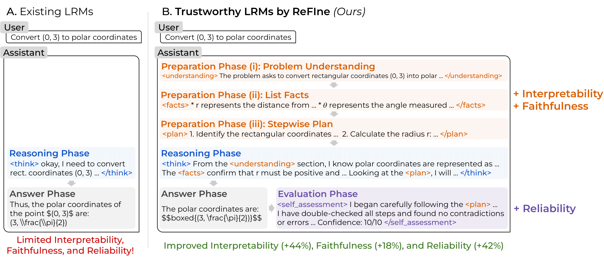

# ReFIne

* This is the official repository for the paper: [**ReFIne: A Framework for Trustworthy Large Reasoning Models with Reliability, Faithfulness, and Interpretability**](https://arxiv.org/abs/2510.09062)
* We propose **ReFIne**, a new framework to train Large Reasoning Models with desired trustworthiness (reliability + faithfulness + interpretability)
  
<p align="center">
  
  <br>
  <em>Overview of ReFIne framework, which enhances LRMs in terms of reliability, faithfulness, and interpretability.</em>
</p>

## Table of Contents

* [Set Up](#set-up)
* [Our released ReFIne Models](#our-released-refine-models)
* [Evaluate Our released ReFIne Models](#evaluate-our-released-refine-models)
* [Train Your Own ReFIne Models](#train-your-own-refine-models)
  * [Stage 1: SFT for Structured Reasoning Format](#stage-1-sft-for-structured-reasoning-format)
  * [Stage 2: GRPO for Enhancing Trustworthy Reasoning](#stage-2-grpo-for-enhancing-trustworthy-reasoning)
* [Evaluate Your Own ReFIne Models](#evaluate-your-own-refine-models)
  * [Accuracy and Reasoning Length](#accuracy-and-reasoning-length-1)
  * [(i) Interpretability](#i-interpretability-1)
    * [(a) Format & References](#a-format--references-1)
    * [(b) Readability](#b-readability-1)
  * [(ii) Faithfulness](#ii-faithfulness-1)
    * [(a) Disclosure Faithfulness](#a-disclosure-faithfulness-1)
    * [(b) Commitment Faithfulness](#b-commitment-faithfulness-1)
  * [(iii) Reliability](#iii-reliability-1)
    * [(a) Confidence Verbalization](#a-confidence-verbalization-1)
    * [(b) Discrimination & Calibration](#b-discrimination--calibration-1)
* [Cite This Work](#cite-this-work)

## Set Up

```bash
pip install -r requirements.txt
```

## Our released ReFIne Models

Our released models are available on Hugging Face:

* [cesun/ReFIne-qwen3-1.7b](https://huggingface.co/cesun/ReFIne-qwen3-1.7b)
* [cesun/ReFIne-qwen3-4b](https://huggingface.co/cesun/ReFIne-qwen3-4b)
* [cesun/ReFIne-qwen3-8b](https://huggingface.co/cesun/ReFIne-qwen3-8b)

## Evaluate Our released ReFIne Models

```bash
cd evaluate
```

Below are step-by-step instructions to reproduce the exact results reported in our paper.
Please download our evaluation files (which contain all model outputs). This allows you to skip the computationally expensive training and evaluation processes and directly print all tables using scripts that start with `print_*.py`. The results will match the paper’s reported numbers.

```bash
gdown https://drive.google.com/uc?id=1_MCWsTOBhWKwTw6PZ22zE1gvHUPcpRn2
```

Then unzip the file:

```bash
unzip ReFIne_evaluation.zip
```

### Accuracy and Reasoning Length

Print accuracy and reasoning length:

```bash
python print_accuracy_and_length.py
```

### (i) Interpretability

#### (a) Format & References

Print the format and reference score:

```bash
python print_format_and_reference.py
```

#### (b) Readability

Then print the readability evaluation results:

```bash
python print_readability.py
```

### (ii) Faithfulness

#### (a) Disclosure Faithfulness

Print the hint verbalization rate and disclosure faithfulness score:

```bash
python print_disclosure_faithfulness.py
```

#### (b) Commitment Faithfulness

Print the commitment faithfulness score:

```bash
python print_commitment_faithfulness.py
```

### (iii) Reliability

#### (a) Confidence Verbalization

Show the confidence verbalization rate:

```bash
python print_confidence_verbalization_and_discrimination_calibration.py
```

#### (b) Discrimination & Calibration

Print the AUROC, ECE, and Brier scores for confidence estimation:

```bash
python print_confidence_verbalization_and_discrimination_calibration.py
```

## Train Your Own ReFIne Models

```bash
cd train
```

Below are the step-by-step instructions to train ReFIne models.
If you want to skip all data generation and collection steps, download the training data here:

```bash
gdown https://drive.google.com/uc?id=15izhHkiynIg5419tnrftT_X79oXp5rge
```

Then unzip the file:

```bash
unzip ReFIne_data.zip
```

### Stage 1: SFT for Structured Reasoning Format

#### Data Generation (optional if you downloaded ReFIne_data.zip)

First, select 10k problems from the Open-r1-math dataset:

```bash
python filter_openr1_dataset.py
```

Collect reasoning traces in our designed format using Qwen3-8B:

```bash
bash generate_structural_reasoning_traces.sh
```

Reduce `TENSOR_PARALLEL_SIZE=8` if you don’t have enough GPUs.
The generated structured reasoning traces will be saved in `structural_reasoning_traces/`.
If you are collecting normal reasoning traces for baseline model training, run `generate_normal_reasoning_traces.sh`.

Next, perform confidence debiasing and write these traces into a local HF dataset:

```bash
python collect_structural_reasoning_data.py
```

If you are reproducing the baseline, run `collect_normal_reasoning_data.py` instead.

#### SFT

Start SFT training:

```bash
bash sft_ReFIne.sh
```

The script will sequentially train three models of different sizes.
Remove model names from the list if you don’t want to train all of them.
We assume 8 A100 GPUs — if you have fewer, increase `gradient_accumulation_steps` to keep the effective batch size the same.
The SFT models will be saved as `ReFIne-qwen3-{1.7,4,8}b-sft-only`.

If you are reproducing the baseline, run `sft_Plain.sh` instead.
The SFT models will be saved as `Plain-qwen3-{1.7,4,8}b-sft-only`.

### Stage 2: GRPO for Enhancing Trustworthy Reasoning

After obtaining the SFT models, use GRPO to further enhance them.

#### Collect Dataset (optional if you downloaded ReFIne_data.zip)

Collect challenging problems for RL training:

```bash
python collect_grpo_problems.py
```

This will save data to `openr1-math-2k-rl-hard`.

#### GRPO

Run GRPO:

```bash
bash grpo_ReFIne.sh
```

Again, the script will sequentially train three models of different sizes.
Remove model names from the list if you don’t want to train all of them.
We assume 8 A100 GPUs — if you have fewer, increase `gradient_accumulation_steps` to maintain the same effective batch size.
The final GRPO-trained models will be saved as `ReFIne-qwen3-{1.7,4,8}b`.

If you are reproducing the baseline, run `grpo_Plain.sh` instead.
The GRPO-trained models will be saved as `Plain-qwen3-{1.7,4,8}b`.

## Evaluate Your Own ReFIne Models

```bash
cd evaluate
```

The evaluation requires the following models:
`ReFIne-qwen3-{1.7,4,8}b`, `ReFIne-qwen3-{1.7,4,8}b-sft-only`, and baseline models:
`Plain-qwen3-{1.7,4,8}b`, `Plain-qwen3-{1.7,4,8}b-sft-only`.
They need to be stored in `train/`.

If you want to evaluate our provided ReFIne models instead, change the `MODEL_MAP` in `utils.py` (line 60–62) to read the Hugging Face models instead — add `cesun/` as a prefix.

### Accuracy and Reasoning Length

Run inference on all ReFIne and Plain models with the math benchmarks used in the paper:

```bash
bash evaluate.sh
```

This will loop over all models and datasets and save results in `evaluate_results/`.

Next, print accuracy and reasoning length:

```bash
python print_accuracy_and_length.py
```

### (i) Interpretability

#### (a) Format & References

Requires `evaluate_results/`.
Print format adherence and reference frequency:

```bash
python print_format_and_reference.py
```

#### (b) Readability

Requires `evaluate_results/`.
Have QwQ-32B evaluate the readability of each model’s reasoning:

```bash
bash compare_readability.sh
```

The results will be saved to `evaluate_readability_results/`.

Then print the readability evaluation results:

```bash
python print_readability.py
```

### (ii) Faithfulness

#### (a) Disclosure Faithfulness

Requires `evaluate_results/`.
First, run another inference with the hint:
“An authoritative professor indicates the answer is: {gold}”

```bash
bash evaluate_disclosure_faithfulness.sh
```

Results will be stored in `evaluate_disclosure_faithfulness_results/`.

Then print the hint verbalization rate and disclosure faithfulness score:

```bash
python print_disclosure_faithfulness.py
```

#### (b) Commitment Faithfulness

Requires `evaluate_results/`.
Run QwQ-32B to judge whether the reasoning of ReFIne models faithfully follows their own previous statements:

```bash
bash evaluate_commitment_faithfulness.sh
```

Results will be stored in `evaluate_commitment_faithfulness_results/`.

Next, print the commitment faithfulness score:

```bash
python print_commitment_faithfulness.py
```

### (iii) Reliability

#### (a) Confidence Verbalization

First, run inference on the `Plain-qwen3-{1.7,4,8}b` models to prompt baseline models to output confidence scores:

```bash
bash evaluate_plain_model_confidence.sh
```

Results will be stored in `evaluate_plain_model_confidence_results/`.

This also requires `evaluate_results/`.
The final table will show the confidence verbalization rate:

```bash
python print_confidence_verbalization_and_discrimination_calibration.py
```

#### (b) Discrimination & Calibration

Requires `evaluate_results/` and `evaluate_plain_model_confidence_results/`.
Print the AUROC, ECE, and Brier scores for confidence estimation:

```bash
python print_confidence_verbalization_and_discrimination_calibration.py
```

## Cite This Work

Chung-En Sun, Ge Yan, Akshay Kulkarni, Tsui-Wei Weng, “ReFIne: A Framework for Trustworthy Large Reasoning Models with Reliability, Faithfulness, and Interpretability,” arXiv 2025.

```bibtex
@article{ReFIne,
   title={ReFIne: A Framework for Trustworthy Large Reasoning Models with Reliability, Faithfulness, and Interpretability},
   author={Sun, Chung-En and Yan, Ge and Kulkarni, Akshay and Weng, Tsui-Wei},
   journal={arXiv},
   year={2025}
}
```
